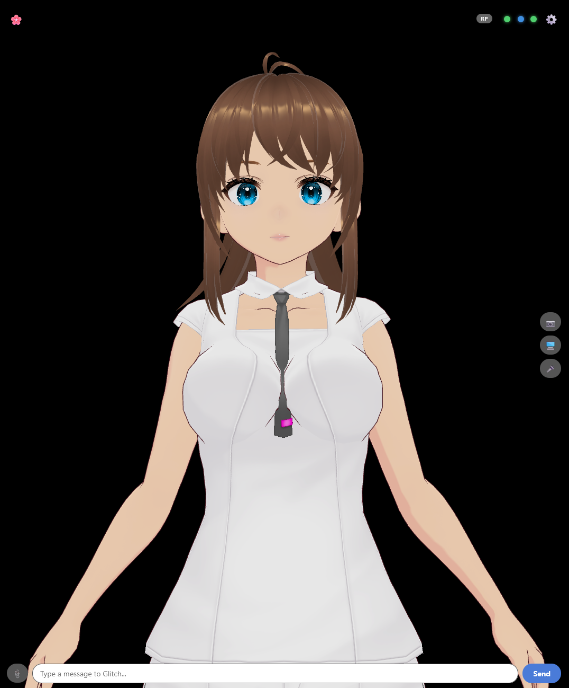

# Glitch

A 3D AI companion you talk to. Glitch is a VRM avatar with a voice, a face that changes with her mood,
a personality you write yourself, and a memory of you that you control. It runs on your own hardware
against whatever LLM you point it at (LM Studio, llama.cpp, Ollama, or any OpenAI-compatible server), and you can
talk to her from your PC, or from your phone over your home network or [Tailscale](https://tailscale.com).

> **Status:** a personal project under active development, shared as-is. It runs as a development
> setup (a Python backend plus a Vite dev server), not a packaged installer. It has been developed and
> tested on **Windows**; the macOS/Linux scripts exist but have had much less testing. Expect rough edges,
> and please open an issue if you hit one.

<p align="center">
  
</p>

The main window with the shipped default avatar:

- **🌸 top left:** chat history (with Resend Last and Clear Chat)
- **top right:** the **RP** badge (shown while role-play is on), three status lights (Brain connection, Hermes harness, speech engine), and **⚙️ Settings**
- **right edge:** 📷 camera, 🖥️ screen capture, 🎤 hold to talk
- **bottom:** 📎 attach a picture or text file, the message box, and **Send**

---

## Contents

- [What it does](#what-it-does)
- [How it fits together](#how-it-fits-together)
- [Requirements](#requirements)
- [Quick start](#quick-start)
- [First run: getting her talking](#first-run-getting-her-talking)
- [Configuration](#configuration)
- [Features in depth](#features-in-depth)
- [Using it from your phone or another PC](#using-it-from-your-phone-or-another-pc)
- [Security](#security)
- [Your data, and backing it up](#your-data-and-backing-it-up)
- [Tests](#tests)
- [Project layout](#project-layout)
- [Troubleshooting](#troubleshooting)
- [Credits](#credits)
- [License](#license)

---

## What it does

- **Talk to a 3D avatar.** Type or hold-to-talk; she answers in text and (optionally) speech, with lip-sync and mood-driven
  expressions. Ships with a default VRM model; import your own `.vrm` or a flat `.png`.
- **A personality you own.** Her *soul* (`soul.md`) and what you tell her about yourself (`user.md`) are plain text files
  that only you edit. Nothing she does can change them.
- **Role-play that can't leak.** Separate role-play souls and user profiles you can switch between. They live in their own
  files and can never overwrite her real personality or your real details. Memory, lessons and curiosity pause during role-play.
- **Memory you can review.** Long-term memory through a [Hindsight](https://pypi.org/project/hindsight-client/) server
  (semantic memory), or a simple flat file. In **training mode** she proposes what to remember and *you* approve, edit and
  rate each item before anything is saved.
- **She learns how you like her to behave.** Rate replies 👍/👎 (with an optional reason) and she distills short behavior
  rules from your feedback. You choose how much she may change on her own, and you can edit or retire any rule.
- **Curiosity.** She asks the occasional follow-up question about what you said, or something she's wondered about you, paced so
  it never turns into an interrogation. Off-limits topics (money, intimacy, health...) are filtered out.
- **Vision.** Show her your camera, your screen, or attach a picture or text file (with a vision-capable model).
- **Web access.** Optional web search through your own [SearXNG](https://docs.searxng.org/) instance, with results labeled
  trusted / unverified / user-uploaded so she doesn't mistake an AI-generated fan upload for the real thing.
- **Optional Hermes agent.** Hand the conversation to a [Hermes Agent](https://github.com/NousResearch/hermes-agent) harness
  instead of your local model, and switch back at any time.
- **Works from your phone.** Open the page on your phone (camera and mic included) over your LAN or Tailscale.

## How it fits together

Two independent programs and one small protocol between them:

```
┌──────────────────────────────┐     WebSocket      ┌───────────────────────────────┐
│  RENDERER  (browser / window) │◄──────────────────►│  BRAIN  (Python)              │
│  three.js + three-vrm         │  via Vite's proxy  │                               │
│  avatar, animation, lip-sync  │                    │  conversation loop            │
│  chat UI, settings, mic,      │                    │  LLM · STT · TTS              │
│  camera, screen capture       │                    │  memory · lessons · curiosity │
│                               │                    │  web search · Hermes harness  │
│  never makes decisions        │                    │  decides everything           │
└──────────────────────────────┘                    └───────────────┬───────────────┘
                                                                     │ HTTP
                          your LLM · speech engine · Hindsight · SearXNG · Hermes
```

- The **Renderer** (`renderer/`) only draws and plays what it is told and reports events back. All the thinking is in the Brain.
- The **Brain** (`brain/`) is a Python WebSocket server. The Renderer connects *to* it (browsers can't listen for connections).
- Your browser never talks to the Brain directly. The Vite dev server proxies `/brain-ws` to it, so the Brain can stay bound to
  `localhost` even when you use Glitch from your phone.
- The message list is documented in [`protocol.md`](protocol.md); the original design notes are in [`SPEC.md`](SPEC.md).

## Requirements

**Software**

| What | Version | Why |
| --- | --- | --- |
| [uv](https://docs.astral.sh/uv/getting-started/installation/) | recent | Installs the right Python and the Brain's dependencies |
| Python | 3.11 or 3.12 | Installed for you by `uv` |
| [Node.js](https://nodejs.org) (with npm) | 20.19+ or 22.12+ | Renderer / Vite dev server |
| An LLM server | any OpenAI-compatible endpoint | LM Studio, llama.cpp `llama-server`, Ollama, vLLM... |
| Git | any | To clone |

**Optional, each unlocks a feature**

| What | Unlocks |
| --- | --- |
| A text-to-speech server with an OpenAI-style `/v1/audio/speech` endpoint, e.g. [Kokoro-FastAPI](https://github.com/remsky/Kokoro-FastAPI) (Docker Compose file included) | Her voice and lip-sync |
| Docker | The bundled Kokoro service (`docker compose up -d`) |
| A [Hindsight](https://pypi.org/project/hindsight-client/) memory server | Semantic long-term memory, memory training, and behavior learning |
| A [SearXNG](https://docs.searxng.org/) instance with JSON output enabled | Web access |
| A vision-capable model | Camera, screen and picture understanding |
| [Hermes Agent](https://github.com/NousResearch/hermes-agent) | The harness mode |
| [Tailscale](https://tailscale.com) | Reaching her securely from your phone away from home |
| Linux only: `python3-gi` and `gir1.2-webkit2-4.1` | The optional native window (`pywebview`) |

**Hardware.** The Brain runs on CPU (speech recognition is pinned to CPU on purpose). What you need is set by your LLM:
a small quantized model runs on a modest GPU; bigger ones need more VRAM. Expect a few GB of downloads on first setup
(PyTorch, the speech-recognition model, the avatar assets) and a decent amount of RAM.

## Quick start

```bash
git clone https://github.com/baijixu/Project-Glitch.git
cd Project-Glitch
```

**1. Install everything**

| Windows | macOS / Linux |
| --- | --- |
| `setup.bat` | `./setup.sh` |

This installs the Brain and Renderer dependencies and creates `config.yaml` and `renderer/.env` from their examples.

**2. Start it**

Windows, one command that opens Brain and Renderer each in its own window:

```bat
start-glitch.bat
```

Or by hand, in two terminals:

```bash
# terminal 1 -- the Brain
cd brain
uv run main.py

# terminal 2 -- the Renderer
cd renderer
npm run dev
```

**3. Open it**

Go to **https://localhost:5173** in your browser. You'll see a certificate warning, because the dev server uses a
self-signed certificate (HTTPS is required so the browser allows camera and microphone). Choose *Advanced → Continue*.

Prefer a native window? With the dev server running: `cd renderer/shell && uv run launch.py`.

## First run: getting her talking

Everything below is done in the **Settings** panel, no config file editing required.

1. **LLM engine.** *Settings → LLM*: add an engine with your server's endpoint (for example
   `http://localhost:1234/v1` for LM Studio) and model name, save it, and select it. Until you do, she replies with
   "no LLM engine configured".
2. **Her soul.** *Settings → Soul & User Files*: write who she is in `soul.md`, and who you are in `user.md`. Both are read
   from `brain/`, and `user.md` is re-read on every message, so edits apply immediately.
3. **Voice (optional).** Start the bundled speech server with `docker compose up -d`, then *Settings → Speech Engine* and add an
   engine with endpoint `http://localhost:8880/v1`. Any server with the OpenAI `/v1/audio/speech` shape works. You can pick
   a voice, and if you use the bundled Kokoro service you can blend your own custom voices.
4. **Memory (optional).** Set the *Memory backend* to *Hindsight* and fill in your server URL and a bank ID
   (see [Memory](#memory)). The default *Local* backend needs no setup.
5. **Avatar (optional).** *Settings → Avatar*: import your own `.vrm` or `.png`.

Then just type, or hold the 🎤 button and speak.

## Configuration

Two small files, both created by the setup script and both **gitignored** (they can hold secrets):

**`config.yaml`** (see [`config.example.yaml`](config.example.yaml), every block is optional):

| Key | Meaning |
| --- | --- |
| `brain.host` / `brain.port` | Where the Brain's WebSocket listens. Default `localhost:8765`. Keep it `localhost` unless you know why not. |
| `brain.auth_token` | Shared secret between Brain and Renderer. **Required if the Brain listens on anything other than localhost.** |
| `brain.llm` | Optional one-time seed for the first LLM engine (you can also do this in Settings). |
| `brain.hindsight` | Hindsight server `api_url` and `bank_id`. |
| `brain.web_search` | `searxng_url`, plus optional `trusted_domains` you consider reliable. |
| `brain.harness` | Optional Hermes endpoint seed. |

**`renderer/.env`**

| Key | Meaning |
| --- | --- |
| `VITE_BRAIN_AUTH_TOKEN` | Must equal `brain.auth_token`. The browser can't read the YAML, so copy it by hand. |

Everything else (which LLM, which voice, which soul, toggles) is chosen in Settings and stored in small local files
under `brain/`.

## Features in depth

### Souls, user info, and role-play

- **`brain/soul.md`**: her personality and example dialogue. **`brain/user.md`**: what you tell her about yourself. Edit them
  in any text editor, or in *Settings → Soul & User Files*. Restart Brain (or save in the editor) after editing `soul.md`;
  `user.md` needs no restart.
- **Role-play** uses separate *Glitch RP Persona* and *User RP Persona* entries you can save, name and switch between. They are
  copied into `rp_soul.md` / `rp_user.md` when selected. **No role-play action ever writes `soul.md` or `user.md`.**
- While role-play is on, her real memory, your `user.md`, learned behavior rules, the clock, and curiosity are all paused, so
  a scene never leaks into real life and vice versa.

> **First-run note:** role-play is treated as *on* until you've toggled it once. If memory or lessons seem inactive on a
> fresh install, open Settings and switch role-play off.

### Memory

Two providers, chosen in Settings:

- **Local** flat file: nothing to set up. She keeps a short list of durable facts.
- **Hindsight** (recommended): a semantic memory server. Relevant memories are recalled per message. She keeps her own bank
  (`bank_id`), separate from any Hermes agent's memory.

Search results and picture descriptions are never stored as if they were facts about you.

### Memory training

Turn on *Settings → Memory training* and nothing is saved automatically. After a reply she proposes at most one short fact,
which waits in a review list. For each one you can **edit the wording**, mark it **Core / Normal / Minor**, and **Save** or
**Reject**. Core facts are always placed in her prompt; the importance is stored as a tag on the memory. It needs the Hindsight
provider. Good for the first weeks, while you're shaping what she remembers.

### Behavior learning

Rate any reply 👍/👎 and optionally say why. She distills your feedback into short rules ("keep replies short", "don't bring up
sports") stored in a separate Hindsight bank and added to her prompt on top of her soul (which is never changed). A *how much
she does on her own* setting decides whether changes need your approval. A bare 👍/👎 can only strengthen or weaken an existing rule; new
rules need a reason. Needs Hindsight.

### Curiosity

Standing guidance to ask at most one natural follow-up, plus a small list of questions she has generated about you in the
background and works in at most every few messages. Questions about money, intimacy, health, family, or anything from fiction or
role-play are never proposed. Toggle it in Settings.

### Voice and vision

- **Speech in:** hold-to-talk, or an always-on mic option, transcribed locally with
  [faster-whisper](https://github.com/SYSTRAN/faster-whisper) (the model downloads on first use).
- **Speech out:** any OpenAI-style TTS endpoint, with viseme lip-sync and per-mood expressions.
- **Vision:** 📷 camera, 🖥️ screen capture, 📎 attach a picture or text file. Needs a vision-capable LLM.

### Web access

Point `brain.web_search.searxng_url` at a SearXNG instance with `search: formats: [html, json]` enabled, then turn on *Web
Access* in Settings. Results are ranked and labeled by how much to trust them, and her reply text from a search turn is not
saved to memory.

### Hermes harness

Add a Hermes Agent gateway in the *Harness* section of Settings and toggle it on to route the conversation through it. Hermes uses its own
memory and skills, not Glitch's.

### Everyday controls

Stop button (cancels a reply in flight), resend last message, two chat layouts (history panel or bubbles over the avatar),
**Restart Brain** button in Settings (useful from a phone), a notes scratchpad (`brain/notes.md`), and an opt-in debug
log of connection and timing events (never conversation content).

A **context meter** under *Settings → LLM* shows how much of the model's context her latest reply used (for example
`4,235 / 65,536 tokens (6%) · 12 of 60 messages`). She keeps the last 60 messages of the conversation. The context size
is read from LM Studio, llama.cpp's `llama-server`, or Ollama.

## Using it from your phone or another PC

Because the page and the Brain-proxy are both served by the Vite dev server, any device that can reach port **5173** can use Glitch:

- **Same network:** open `https://<your-pc-ip>:5173` on the phone and accept the certificate warning once.
- **Anywhere, securely, recommended:** install [Tailscale](https://tailscale.com) on your PC and phone and open
  `https://<your-pc's-tailscale-ip>:5173`. No ports are opened to the internet.

Keep `brain.host: localhost` in this setup, since the phone never talks to the Brain directly.
If you *do* let the Brain listen on other addresses, set `brain.auth_token` (and the matching `renderer/.env` value).

## Security

Glitch is a personal tool, not a hardened service. Know these before exposing it:

- **Anyone who can open the Renderer's page can use Glitch** as you, because the page (which contains the auth token) is served
  to them. Only expose port 5173 on networks you trust, or only over Tailscale. **Never port-forward it to the internet.**
- The Brain rejects a wrong or missing token, and locks an IP out for a minute after five failed attempts.
- `config.yaml` and `renderer/.env` contain secrets and are gitignored. Backups contain them too, so keep those private.
- Glitch has **no content filter of its own.** What she says depends entirely on the model and soul you give her, and you are
  responsible for them.
- Links she shares are not scanned. Treat them like any link from the internet.

## Your data, and backing it up

Git only holds the code. Everything personal is **gitignored** and lives on your machine: `brain/soul.md`, `brain/user.md`,
the role-play files, `brain/souls/`, `brain/profiles/`, notes, lessons, ratings, toggles, saved engines, avatars, custom
voices, and your configs.

Two of those are your conversations:

- **`brain/conversation.json`**: what she currently remembers of the chat. It's saved after every reply and picked back up
  when the Brain restarts or you switch LLM engine, so a restart no longer wipes her short-term memory. A role-play
  conversation is only restored into role-play, and a normal one only into normal chat. Pictures are kept as a
  `[picture]` note, not the image itself.
- **`brain/chat_logs/`**: a timestamped log of every exchange, one Markdown file per day (`2026-09-24.md`), for you to read.

Back it all up with one command:

```bash
python tools/backup_local_state.py
```

This copies every gitignored local file to a dated folder **outside** the repo (`../glitch-backups/`), verifies each copy by hash,
skips the run if nothing changed, and keeps the newest 10. Options: `--dest PATH`, `--keep N`, `--force`. To restore, copy the files
back to the same relative paths and restart the Brain. Memory that lives in a Hindsight server is backed up separately, on that server.

## Tests

```bash
run-tests.bat            # Windows
./run-tests.sh           # macOS / Linux
run-tests.bat tests.test_memory   # a single file
```

96 tests, standard-library `unittest`, no network or LLM required (a fake model and websocket drive the real code, isolated to a
temp folder so they never touch your real files). See [`tests/README.md`](tests/README.md).

## Project layout

```
brain/                 Python backend (WebSocket server)
  main.py              entry point and message handling
  llm/                 LLM clients (OpenAI-compatible, Ollama native, Hermes harness)
  voice/               speech-to-text and text-to-speech
  memory.py            memory providers (local / Hindsight), core-fact recall
  training.py          memory-training review queue
  lessons.py           behavior learning
  curiosity.py         follow-up questions
  souls.py profiles.py soul / user / role-play file handling
  web_search.py        SearXNG search and trust labels
  protocol.py          message constructors
renderer/              Vite + three.js front end
  src/                 avatar, chat UI, settings panels, Brain client
  shell/               optional pywebview native window
  assets/Glitch.vrm    default avatar
tests/                 unit and integration tests
tools/                 backup_local_state.py
config.example.yaml    copy to config.yaml
docker-compose.yml     optional Kokoro speech server
protocol.md            Brain <-> Renderer messages
SPEC.md                original design notes
```

## Troubleshooting

| Symptom | Try |
| --- | --- |
| Certificate warning in the browser | Expected: self-signed HTTPS. Choose *Advanced → Continue*. Needed for camera and mic. |
| She only says "no LLM engine configured" | Add and select an LLM engine in *Settings → LLM*. |
| She never speaks | No speech engine is selected. Add one in *Settings → Speech Engine*, and check the *Voice* toggle. |
| Memory, lessons or curiosity seem inactive | Role-play may be on (it pauses them). Toggle it off in Settings. Lessons and memory training also need the Hindsight provider. |
| Phone can't connect | Both devices on the same network or Tailscale, port 5173 reachable, and Vite running with its default `host: true`. Check the PC's firewall. |
| Camera or mic won't start on the phone | The page must be HTTPS. Use the `https://` address and accept the warning. |
| Photos look black | Reload the page and retry, and check the browser's camera permission for the site. |
| "failed auth" in the Brain log | The Renderer's token doesn't match. Set `VITE_BRAIN_AUTH_TOKEN` to the same value as `brain.auth_token`, then restart the dev server. |
| Edited `soul.md` but nothing changed | The soul is read at startup: restart Brain (Settings → Restart Brain) or save it in the Settings editor. |
| Replies are empty or cut off | A reasoning model may be spending its whole token budget thinking. Cap its reasoning in your LLM server, or use a non-reasoning model. |
| Linux: native window fails | Install `python3-gi` and `gir1.2-webkit2-4.1`, or just use the browser. |
| Something else | Turn on the debug log in Settings, or run `uv run main.py` and read the Brain's console. |

## Credits

Built on [three.js](https://threejs.org), [@pixiv/three-vrm](https://github.com/pixiv/three-vrm), [Vite](https://vitejs.dev),
[faster-whisper](https://github.com/SYSTRAN/faster-whisper), [Kokoro](https://github.com/hexgrad/kokoro) and
[Kokoro-FastAPI](https://github.com/remsky/Kokoro-FastAPI), [Hindsight](https://pypi.org/project/hindsight-client/),
[SearXNG](https://docs.searxng.org/), [pywebview](https://pywebview.flowrl.com), [uv](https://docs.astral.sh/uv/), and optionally
[Hermes Agent](https://github.com/NousResearch/hermes-agent) and [Tailscale](https://tailscale.com).

## License

[MIT](LICENSE). You can use, modify and share the code and the included default avatar freely, including commercially, as long as
the license notice stays with it. It comes with no warranty.

Third-party projects listed under [Credits](#credits) keep their own licenses. Any character artwork that isn't in this repository
isn't covered by it.
