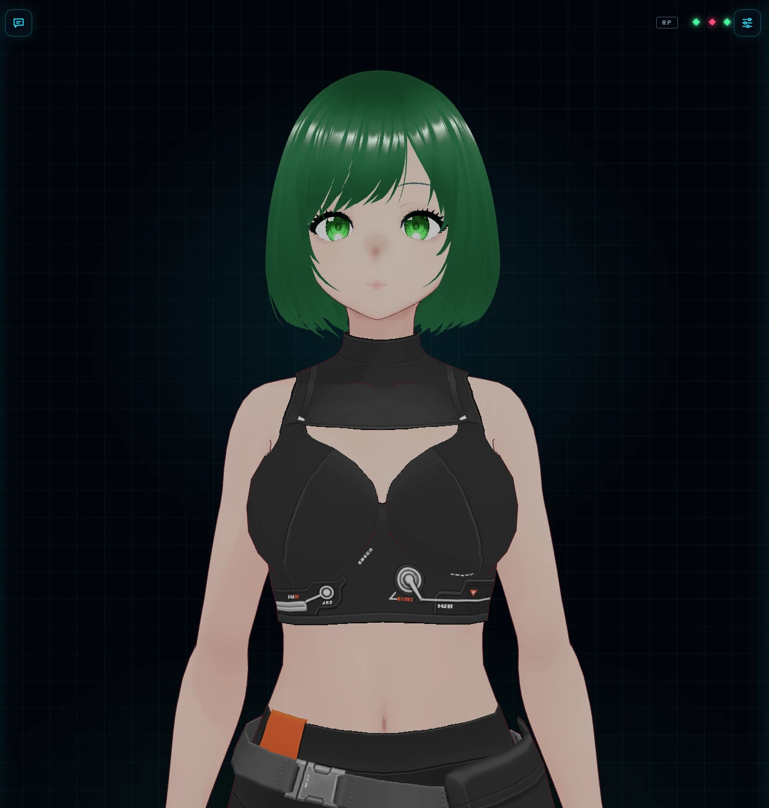
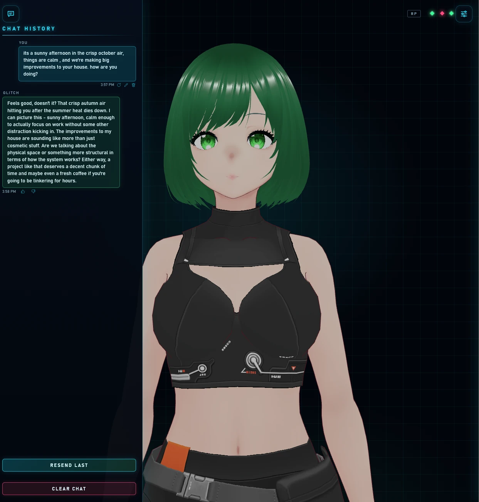
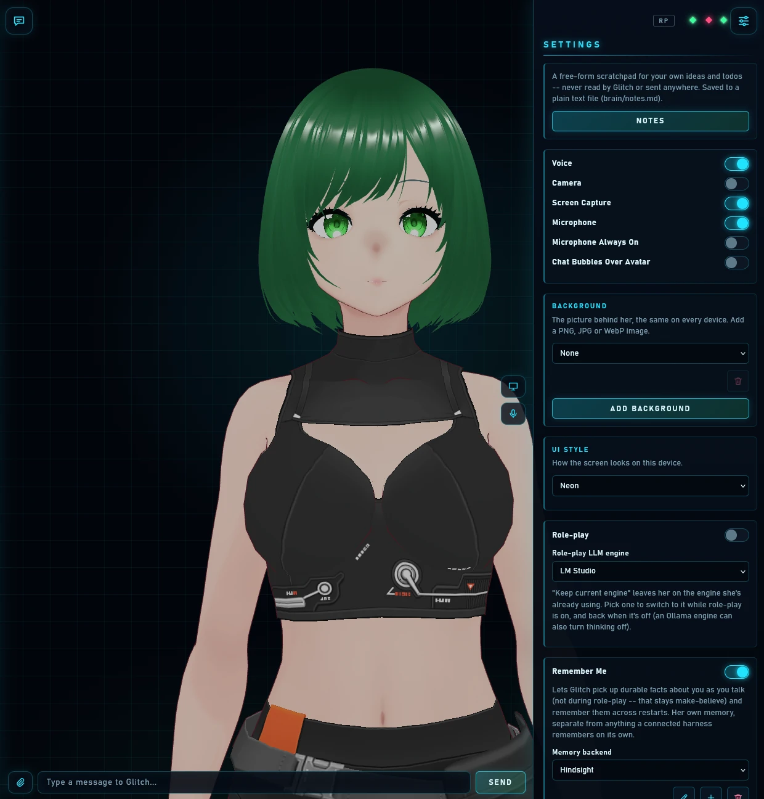

# Glitch

A 3D AI companion you talk to. Glitch is a VRM avatar with a voice, a face that changes with her mood,
a personality you write yourself, and a memory of you that you control. It runs on your own hardware
against whatever LLM you point it at (LM Studio, llama.cpp, Ollama, or any OpenAI-compatible server), and you can
talk to her from your PC, or from your phone over your home network or [Tailscale](https://tailscale.com).

- **Fully local.** Your LLM, your speech, your memory server, with no cloud AI service involved. Built and used day to day
  with a 9B model (Qwen3.5 9B) on a 12 GB GPU.
- **A memory you control.** Long-term recall through your own [Hindsight server](#memory), and with
  [memory training](#memory-training) on, she proposes each memory and you edit, approve or reject it before she keeps it.
- **She learns from your 👍/👎.** Rate a reply, say why, and she turns it into a short behavior rule, which can wait for
  your approval ([behavior learning](#behavior-learning)).
- **She speaks first, sometimes.** After a quiet spell she may ask you something she's been curious about, once, and
  never the same question twice ([curiosity](#curiosity)).
- **Role-play and work, kept apart.** A [role-play mode](#souls-user-info-and-role-play) with its own personas and chat
  logs that never touches her real memory, and a
  [harness mode](#harness-mode-her-professional-self) where she drives an agent harness (Hermes Agent, OpenClaw, or any
  OpenAI-compatible one) with a separate work persona and memory, so personal and professional never mix.

> **Status:** a personal project under active development, shared as-is. It runs as a development
> setup (a Python backend plus a Vite dev server), not a packaged installer. It has been developed and
> tested on **Windows**; the macOS/Linux scripts exist but have had much less testing. Expect rough edges,
> and please open an issue if you hit one.

<p align="center">
  
  
  
</p>

The shipped default avatar in the Neon UI style (Settings → UI Style), with the chat history and Settings open:

- **top left:** chat history (with Resend Last and Clear Chat, and 👍/👎 on her replies)
- **top right:** the **RP** badge (lit while role-play is on), three status lights (Brain connection, harness, speech engine), and **Settings**
- **right edge:** camera, screen capture, hold to talk
- **bottom:** attach a picture or text file, the message box, and **Send**

---

## Contents

- [What it does](#what-it-does)
- [How it fits together](#how-it-fits-together)
- [Requirements](#requirements)
- [Quick start](#quick-start)
- [First run: getting her talking](#first-run-getting-her-talking)
- [Configuration](#configuration)
- [Settings at a glance](#settings-at-a-glance)
- [Features in depth](#features-in-depth)
- [Using it from your phone or another PC](#using-it-from-your-phone-or-another-pc)
- [Security](#security)
- [Your data, and backing it up](#your-data-and-backing-it-up)
- [Project layout](#project-layout)
- [Troubleshooting](#troubleshooting)
- [Credits](#credits)
- [License](#license)

---

## What it does

- **Talk to a 3D avatar.** Type or hold-to-talk; she answers in text and (optionally) speech, with lip-sync and mood-driven
  expressions. Ships with a default VRM model; import, rename and delete your own `.vrm` or flat `.png` avatars.
- **A personality you own.** Her *soul* (`soul.md`) and what you tell her about yourself (`user.md`) are plain text files
  that only you edit. Nothing she does can change them.
- **She knows what time it is, and how long you've been gone.** See [Time](#time).
- **Role-play that can't leak.** Separate role-play souls and user profiles you can switch between. They live in their own
  files and can never overwrite her real personality or your real details. Memory, lessons and curiosity pause during role-play,
  and the role-play conversation and its log are kept apart from your real one.
- **Memory you can review.** Long-term memory through a memory server you run
  ([Hindsight](https://pypi.org/project/hindsight-client/)),
  or a simple flat file. In **training mode** she proposes what to remember and *you* approve, edit and
  rate each item before anything is saved, and what you approve is stored exactly as you worded it.
- **She learns how you like her to behave.** Rate replies 👍/👎 with a reason and she distills short behavior
  rules from your feedback. You choose how much she may change on her own, and you can edit or retire any rule.
- **Curiosity.** She asks the occasional follow-up question about what you said, or something she's wondered about you, paced so
  it never turns into an interrogation and never repeats. After 15-60 minutes of quiet (random) she reaches out first, once, until you reply.
- **Tune how she talks.** Sampling profiles (temperature, top P, min P...) you save and switch between, applied from her next reply.
- **Vision.** Show her your camera, your screen, or attach a picture or text file (with a vision-capable model).
- **Web access.** Optional web search through your own [SearXNG](https://docs.searxng.org/) instance, with results labeled
  trusted / unverified / user-uploaded so she doesn't mistake an AI-generated fan upload for the real thing.
- **Optional agent harness.** Hand the conversation to an agent harness such as
  [Hermes Agent](https://github.com/NousResearch/hermes-agent) or [OpenClaw](https://docs.openclaw.ai/), her "professional"
  self with its own soul, memory and tools, and switch back at any time. Nothing personal crosses over.
- **Your chat logs, readable.** A daily log of your conversations you can read or delete from Settings.
- **Works from your phone.** Open the page on your phone (camera and mic included) over your LAN or Tailscale.
- **A debug log that explains itself.** One download shows her whole setup, timings, token counts and every failure, and
  never your conversation.

## How it fits together

Two independent programs and one small protocol between them:

```
┌──────────────────────────────┐     WebSocket      ┌───────────────────────────────┐
│  RENDERER  (browser / window) │◄──────────────────►│  BRAIN  (Python)              │
│  three.js + three-vrm         │  via Vite's proxy  │                               │
│  avatar, animation, lip-sync  │                    │  conversation loop            │
│  chat UI, settings, mic,      │                    │  LLM · STT · TTS              │
│  camera, screen capture       │                    │  memory · lessons · curiosity │
│                               │                    │  web search · agent harness   │
│  never makes decisions        │                    │  decides everything           │
└──────────────────────────────┘                    └───────────────┬───────────────┘
                                                                     │ HTTP
                          your LLM · speech engine · Hindsight · SearXNG · harness
```

- The **Renderer** (`renderer/`) only draws and plays what it is told and reports events back. All the thinking is in the Brain.
- The **Brain** (`brain/`) is a Python WebSocket server. The Renderer connects *to* it (browsers can't listen for connections).
- Your browser never talks to the Brain directly. The Vite dev server proxies `/brain-ws` to it, so the Brain can stay bound to
  `localhost` even when you use Glitch from your phone.
- There is **one Brain and one conversation**, shared by every connected device: settings you change on your phone show on
  your PC too.
- The message list is documented in [`protocol.md`](protocol.md); the original design notes are in [`SPEC.md`](SPEC.md).

## Requirements

**Software**

| What | Version | Why |
| --- | --- | --- |
| [uv](https://docs.astral.sh/uv/getting-started/installation/) | recent | Installs the right Python and the Brain's dependencies |
| Python | 3.11 or 3.12 | Installed for you by `uv` |
| [Node.js](https://nodejs.org) (with npm) | 20.19+ or 22.12+ | Renderer / Vite dev server |
| An LLM server | any OpenAI-compatible endpoint | LM Studio, llama.cpp `llama-server`, Ollama, vLLM... |
| Git | any | To clone |

**Optional, each unlocks a feature**

| What | Unlocks |
| --- | --- |
| A text-to-speech server with an OpenAI-style `/v1/audio/speech` endpoint, e.g. [Kokoro-FastAPI](https://github.com/remsky/Kokoro-FastAPI) (Docker Compose file included) | Her voice and lip-sync |
| Docker | The bundled Kokoro service (`docker compose up -d`) |
| A memory server: [Hindsight](https://pypi.org/project/hindsight-client/) | Semantic long-term memory and memory training (behavior learning needs Hindsight) |
| A [SearXNG](https://docs.searxng.org/) instance with JSON output enabled | Web access |
| A vision-capable model | Camera, screen and picture understanding |
| An agent harness with an OpenAI-compatible endpoint, e.g. [Hermes Agent](https://github.com/NousResearch/hermes-agent) or [OpenClaw](https://docs.openclaw.ai/) | The harness mode |
| [Tailscale](https://tailscale.com) | Reaching her securely from your phone away from home |

**Hardware she's built on.** Glitch is developed and used every day on this setup:

| Machine | Hardware | Runs |
| --- | --- | --- |
| Main PC | AMD Ryzen 9 5950X, 64 GB RAM, NVIDIA RTX 3060 (12 GB), Windows 11 Pro | The Brain, the Renderer's dev server, and LM Studio with her model: Qwen3.5 9B (uncensored, Q8_0, 65k context, every layer on the GPU) |
| A second PC on the same network | an NVIDIA GPU | Her voice (Qwen3-TTS) and Hindsight with its own 9B model |
| Phone | a current phone browser | Talking to her, at home or over Tailscale |

Measured on the 3060: her model fills 11.9 of its 12 GB and writes about 23 tokens a second, with her 3D view open in a
browser on the same PC. The 3D view itself costs about a tenth of the GPU.

**Recommended hardware.** What you need is set mostly by the LLM:

- **For her model:** an NVIDIA GPU with **12 GB** runs a 9B model at Q8 entirely on the GPU, as above. With less, use a
  smaller quantization or a smaller model. A **24 GB** card (RTX 3090 or 4090) leaves room for a bigger model, a longer
  conversation, or her voice on the same card.
- **For her voice:** the bundled Kokoro server runs on the CPU, no GPU needed. Qwen3-TTS, the more expressive one, needs an
  NVIDIA GPU with about 4.5 GB free.
- **For memory:** Hindsight needs an LLM of its own, ideally 7-9B (see [Memory](#memory)). Put it on a second machine, or a
  card with room to spare: it shouldn't take memory away from her model.
- **CPU and RAM:** the Brain runs on the CPU, speech recognition included (pinned there on purpose). 16 GB of RAM covers
  the Brain and the Renderer; you need more if part of your model runs on the CPU.
- **To talk to her:** any device with a current browser that supports WebGL 2, phones included.
- **Mind the shared GPU:** if her 3D view and her model are on the same graphics card, anything heavy on screen slows her
  down. A blur effect over her 3D view once dropped her from about 10 tokens a second to 1.

Expect a few GB of downloads on first setup (PyTorch, the speech-recognition model, the avatar assets).

## Quick start

```bash
git clone https://github.com/baijixu/Project-Glitch.git
cd Project-Glitch
```

**1. Install everything**

| Windows | macOS / Linux |
| --- | --- |
| `setup.bat` | `./setup.sh` |

This installs the Brain and Renderer dependencies and creates `config.yaml` and `renderer/.env` from their examples.

**2. Start it**

Windows, one command that opens Brain and Renderer each in its own window (the Renderer starts 10 seconds after the Brain,
so the Brain is listening by the time it comes up):

```bat
start-glitch.bat
```

Or by hand, in two terminals:

```bash
# terminal 1 -- the Brain
cd brain
uv run main.py

# terminal 2 -- the Renderer
cd renderer
npm run dev
```

**3. Open it**

Go to **https://localhost:5173** in your browser. You'll see a certificate warning, because the dev server uses a
self-signed certificate (HTTPS is required so the browser allows camera and microphone). Choose *Advanced → Continue*.

## First run: getting her talking

Everything below is done in the **Settings** panel, no config file editing required.

1. **LLM engine.** *Settings → LLM*: add an engine with your server's endpoint (for example
   `http://localhost:1234/v1` for LM Studio) and model name, save it, and select it. Until you do, her only reply is
   "No LLM engine is configured yet".
2. **Her soul.** *Settings → Soul & User Files*: write who she is in `soul.md`, and who you are in `user.md`. Both are read
   from `brain/`, and `user.md` is re-read on every message, so edits apply immediately.
3. **Voice (optional).** Start the bundled speech server with `docker compose up -d`, then *Settings → Speech Engine* and add an
   engine with endpoint `http://localhost:8880/v1`. Any server with the OpenAI `/v1/audio/speech` shape works. You can pick
   a voice, and if you use the bundled Kokoro service you can blend your own custom voices. For a more expressive voice on an
   NVIDIA GPU (~4.5 GB), run Qwen3-TTS with `tools/qwen_tts_server.py` (setup in its header, no Docker needed) and use endpoint
   `http://<that machine>:8001/v1` with a voice such as `Serena`, `Vivian` or `Ryan`.
4. **Memory (optional).** Under *Memory backend*, press ➕ to add your Hindsight server (URL, API key, bank
   ID), then pick it (see [Memory](#memory)). The built-in *Local file* needs no setup.
5. **Avatar (optional).** *Settings → Avatar*: import your own `.vrm` or `.png`.

Then just type, or hold the 🎤 button and speak.

## Configuration

Two small files, both created by the setup script and both **gitignored** (they can hold secrets):

**`config.yaml`** (see [`config.example.yaml`](config.example.yaml), every block is optional):

| Key | Meaning |
| --- | --- |
| `brain.host` / `brain.port` | Where the Brain's WebSocket listens. Default `localhost:8765`. Keep it `localhost` unless you know why not. |
| `brain.auth_token` | Shared secret between Brain and Renderer. **Required if the Brain listens on anything other than localhost.** |
| `brain.llm` | Optional one-time seed for the first LLM engine (you can also do this in Settings). |
| `brain.hindsight` | Optional one-time seed: a Hindsight server's `api_url` and `bank_id`, saved as the first memory backend. |
| `brain.web_search` | `searxng_url`, plus optional `trusted_domains` you consider reliable. |
| `brain.harness` | Optional harness seed (Hermes and OpenClaw examples included). |

**`renderer/.env`**

| Key | Meaning |
| --- | --- |
| `VITE_BRAIN_AUTH_TOKEN` | Must equal `brain.auth_token`. The browser can't read the YAML, so copy it by hand. |

Everything else (which LLM, which voice, which soul, toggles) is chosen in Settings and stored in small local files
under `brain/`.

## Settings at a glance

The ⚙️ panel, top to bottom:

| Section | What it's for |
| --- | --- |
| **Notes** | A private scratchpad (`brain/notes.md`). She never reads it. |
| **Quick toggles** | Voice, camera, screen capture, microphone, always-on mic, chat bubbles over the avatar. |
| **Background** | The picture behind her: add, pick or delete; the same on every device. |
| **UI Style** | *Classic* or *Neon* (dark glass and glowing lines), per device. |
| **Role-play** | On/off, the engine role-play uses, and your *User RP Persona*. |
| **Glitch RP Persona** | Her saved role-play souls. |
| **Remember Me** | Memory on/off, the memory backend (the Local file, or saved Hindsight servers), Download / Clear Memory. |
| **Web Access** | Lets her search the web through your SearXNG. |
| **Curiosity** | Follow-up questions and reaching out after a quiet spell. |
| **Memory training** | Review what she wants to remember before it's saved. |
| **Behavior learning** | The rules she's learned from your ratings, and how much she may change on her own. |
| **Avatar** | Pick, import, rename or delete avatars. |
| **Speech Engine** | Her voice: engines, voices, blended Kokoro voices. |
| **LLM** | Engines, sampling profiles, and the context meter. |
| **Harness** | Hand the conversation to an agent harness (locks everything above while it's on). |
| **Soul & User Files** | Edit `soul.md` and `user.md` directly. |
| **Chat Logs** | Read or delete a day's chat or role-play log. |
| **Debugging** | The debug log and its download. |
| **Restart Brain** | Restarts the Brain process; her conversation is saved and picked back up. |

## Features in depth

### Souls, user info, and role-play

- **`brain/soul.md`**: her personality and example dialogue. **`brain/user.md`**: what you tell her about yourself. Edit them
  in any text editor, or in *Settings → Soul & User Files*. Restart Brain (or save in the editor) after editing `soul.md`;
  `user.md` needs no restart. A fixed line in her prompt keeps the two apart: her looks, clothes and tastes are the ones in her
  soul, yours are the ones you've told her.
- **Role-play** uses separate *Glitch RP Persona* and *User RP Persona* entries you can save, name and switch between. They are
  copied into `rp_soul.md` / `rp_user.md` when selected. **No role-play action ever writes `soul.md` or `user.md`.**
- While role-play is on, her real memory, your `user.md`, learned behavior rules, the clock, and curiosity are all paused, so
  a scene never leaks into real life and vice versa.
- **Role-play stays on her current LLM engine** by default. To give it its own, pick one under *Role-play LLM engine*:
  turning role-play on then switches her to it (a dialog lets you turn thinking off, which only works on an Ollama-provider
  engine), and turning it off puts her back on the engine she was using before.
- The normal conversation and the role-play scene are saved separately, so switching between them doesn't lose either one.
  Their chat logs are kept separately too.

### Memory

Pick her *Memory backend* in Settings:

- **Local file** (built in): nothing to set up. She keeps a short list of durable facts.
- **A memory server you run** (recommended). Add as many as you like with ➕ (a name, the type, its URL, an API key if it
  needs one, and the bank or user id her memories go under), then pick one. ✏️ edits and 🗑️ deletes a saved connection;
  the memories on the server stay there. Relevant memories are recalled per message, and she keeps her own bank,
  separate from any harness's own memory.

| Type | What to enter | Notes |
| --- | --- | --- |
| [Hindsight](https://pypi.org/project/hindsight-client/) | URL like `http://localhost:8899`, a bank ID | Everything works: memory training, behavior learning, and her own-voice missions set on the bank. |

Other engines (Mem0, Zep, Letta...) each speak their own API, so they need a small connector in
[`brain/memory.py`](brain/memory.py) and a type in [`brain/memory_profiles.py`](brain/memory_profiles.py).

Her memories are written in her own voice ("I promised Sam I'd help with their song"). Search results and picture descriptions
are never stored as if they were facts about you.

**About Hindsight's own model.** Hindsight rewrites what it's given and builds summaries ("observations") with an LLM of its
own, configured on the Hindsight server. Glitch tells her bank that "I" in her memories means her, which keeps owners straight,
but a very small model still makes mistakes (a 4B model swapped "my hair" to "the user's hair" and failed about a third of its
rewrites in testing). A 7–9B model is a much better fit. Facts you approve in memory training skip the rewrite entirely and
are stored word for word.

### Memory training

Turn on *Settings → Memory training* and nothing is saved automatically. Each night, after her journal, she reads the day's
chat log and proposes a few short facts, which wait in a review list. For each one you can **edit the wording**, mark it **Core / Normal / Minor**, and **Save** or
**Reject**. What you save is stored exactly as you worded it. Core facts are always placed in her prompt; the importance is
stored as a tag on the memory. It needs a Hindsight memory server. Good for the first weeks, while you're shaping what she
remembers.

### Behavior learning

Rate any reply 👍/👎 and say why in the pop-up (a reason is required). She distills your feedback into short rules ("keep replies
short", "don't bring up sports") stored in a separate Hindsight bank and added to her prompt on top of her soul (which is never
changed). A *how much she does on her own* setting decides whether changes need your approval: *Ask first* (every change waits
for you), *Small tweaks on her own* (strengthening or weakening a rule is automatic), or *Everything on her own*. Needs a
Hindsight memory backend.

### Time

A model has no clock, so each of your messages reaches her with a line you don't see: the current date, time and timezone, and how
long ago the previous message was ("about 3 hours ago, on Saturday 26 September, 10:40 PM"). Each message in her conversation
also remembers when it was said. After a break of an hour or more, your next message is kept with a short marker in front,
`[2 days later -- Tuesday 29 September, 9:10 AM]`, so she can still see where the breaks were later in the conversation.
Shorter gaps get no marker. None of this happens during role-play, where time is the scene's.

Her memories are dated too: each recalled memory ends with when she learned it, "(learned 3 days ago)", from the date the
memory server saved it, so she can tell that "moving next month" was said a month ago. The local file
keeps no dates.

### Curiosity

Three parts, all toggled by *Curiosity* in Settings and paused during role-play and while a harness is in control:

- **Follow-ups.** Standing guidance to ask at most one natural question now and then, and not in two replies running.
- **Things she wonders about.** Every few of your messages she may note one thing she'd like to know about you, and she works one
  in at most every few messages. A question is never kept or asked twice, even reworded. There's no list of forbidden topics.
- **Speaking first.** After an hour with no message from you, she reaches out once (with a question she's been saving, or just
  checking in), on every connected device. If you don't reply she stays quiet; your next message, or Clear Chat, starts the hour again. *Settings → Curiosity* shows a live countdown to when she may reach out (or why she's waiting), and a **Test reach-out** button makes her do it right away.

Your answer is remembered like anything else you tell her, together with the question it answers, so with memory training on it
shows up in the review list.

### Voice and vision

- **Speech in:** hold-to-talk, or an always-on mic option, transcribed locally with
  [faster-whisper](https://github.com/SYSTRAN/faster-whisper) (the model downloads on first use).
- **Speech out:** any OpenAI-style TTS endpoint, with viseme lip-sync and per-mood expressions. Browsers (phones especially)
  block sound until the page has been tapped; Glitch unlocks it on your first tap or key press.
- **Vision:** 📷 camera, 🖥️ screen capture, 📎 attach a picture or text file. Needs a vision-capable LLM.

### Avatars

*Settings → Avatar*: pick an installed avatar, **Import VRM** or **Import PNG** (a flat image, the camera can't pan around it),
and ✏️ rename or 🗑️ delete your own. Renaming keeps it active under the new name; deleting the one on screen switches back to
the built-in Glitch, which can't be renamed or deleted. Every connected device follows.

### LLM: sampling profiles and the context meter

**Sampling profiles** under *Settings → LLM* set how she picks her words: temperature, top P, top K, min P,
presence penalty and repeat penalty, sent with each of her replies (LM Studio, llama.cpp and Ollama all honor them per
request, over their own saved settings). Tune the boxes and save them as a named profile; picking a profile applies it
from her next reply. The built-in *Qwen 3.6 Thinking* profile uses Qwen's recommended thinking-mode settings
(temperature 1.0, top P 0.95, top K 20, min P 0, presence penalty 1.5, repeat penalty 1.0), and *Server defaults* sends
nothing so the server's own settings apply. A blank box also leaves that one to the server. Only her replies use a
profile; the short background tasks (memory, curiosity and lesson proposals) keep the server's settings.

A **context meter** shows two bars. *Conversation* is how much of the chat she's holding on to, out of what she keeps
(for example `~24,120 / 32,768 kept (74%)`): she keeps as much of the conversation as fits in about half of the model's
context (12,000 tokens if the server doesn't report its size). Past 100%, the next message drops the oldest ~40% in one
go, so the model can keep reusing its work on the rest; that's when she starts forgetting how the conversation began.
*Total context* is everything the model read and wrote for her latest reply (soul, notes, memories, the conversation,
her thinking and the reply) out of its full context, for example `29,850 / 65,536 tokens (46%)`. The context size is
read from LM Studio, llama.cpp's `llama-server`, or Ollama.

Replies get an 8,000-token budget and an 8-minute timeout, so a reasoning model has room to think; if it still runs out,
she answers again without thinking rather than saying nothing.

### Web access

Point `brain.web_search.searxng_url` at a SearXNG instance with `search: formats: [html, json]` enabled, then turn on *Web
Access* in Settings. Results are ranked and labeled by how much to trust them, and her reply text from a search turn is not
saved to memory.

### Harness mode: her professional self

Add an agent harness in the *Harness* section of Settings and toggle it on to route the conversation through it. Any harness
with an OpenAI-compatible `/v1/chat/completions` endpoint works. The idea is two separate selves: **Glitch the companion**
(her soul, her memory, her chat log) and **her work self** (the harness's own persona, memory and tools). While a harness is
in control:

- Glitch sends the harness only your message (and any picture): not her soul, not `user.md`, not her memories.
- Nothing is saved to her memory, memory training, curiosity or lessons, and the conversation isn't written to her chat log
  (the harness keeps its own).
- **The harness keeps the conversation going** from one message to the next, and across Brain restarts: Glitch tells it
  which conversation each message belongs to. **Clear Chat** starts a new one there. Resend and ✏️ edit add a new message
  rather than replacing the last one.
- For facial expressions, have the harness's persona end replies with a `[mood: ...]` tag, like her own soul does.
  Without it she stays neutral.

| Harness | Endpoint | Model | API key |
| --- | --- | --- | --- |
| [Hermes Agent](https://github.com/NousResearch/hermes-agent) (run `hermes gateway` with the api_server platform on) | `http://localhost:8642/v1` | blank | Hermes's `API_SERVER_KEY`. **Needed** for Hermes to continue a conversation; without it each message starts a new one. |
| [OpenClaw](https://docs.openclaw.ai/gateway/openai-http-api) (set `gateway.http.endpoints.chatCompletions.enabled: true`) | `http://localhost:18789/v1` | `openclaw` or `openclaw/<agentId>` | Your gateway token. |
| Anything else OpenAI-compatible | its `/v1` URL | whatever it expects | if it needs one |

If the harness has a memory of its own (Hermes with Hindsight, for example), set it to keep work only, so personal material
stays in her own memory.

### Chat logs

Every exchange with her is written to a daily Markdown file: `brain/chat_logs/2026-09-24.md`, with role-play in
`brain/chat_logs/roleplay/`. *Settings → Chat Logs* lets you pick Chat or Role-play and a day, then **Read** it in a pop-up
or 🗑️ **Delete** it. When she reaches out first, that's logged too.

### The debug log

*Settings → Debugging* (on by default, per device) records what's needed to diagnose a problem, and never conversation
content. **Download Debug Log** gives a text file with:

- **A header:** your device ("Android phone · Chrome 140"), its hardware and window, and local time and timezone (entries are UTC).
- **A setup snapshot** whenever debugging is turned on: Brain's version and uptime, every connected device and how it connects
  (this PC, home network, Tailscale), the LLM engine, model, context size and which models are loaded on the server, the sampling
  profile, speech engine, memory backend and Hindsight's own model, every feature switch, what's waiting for review, and any
  problems since Brain started.
- **Every reply:** timing for memory recall, the LLM and speech, with prompt, reply and thinking token counts; when the
  conversation is trimmed; time spent waiting behind another reply; which models are loaded when a reply is slow.
- **Events:** settings you change (names and on/off only), role-play toggles and which device made them, curiosity's decisions,
  her reaching out, sound being blocked by the browser, Renderer errors, and every failure Brain prints.

### Everyday controls

Stop button (cancels a reply in flight), resend last message, ✏️ edit your latest message (she answers the corrected
version instead), **Clear Chat** (starts her on a fresh conversation; her long-term memory stays), two chat layouts
(history panel or bubbles over the avatar), and **Restart Brain** in Settings (useful from a phone).

## Using it from your phone or another PC

Because the page and the Brain-proxy are both served by the Vite dev server, any device that can reach port **5173** can use Glitch:

- **Same network:** open `https://<your-pc-ip>:5173` on the phone and accept the certificate warning once.
- **Anywhere, securely, recommended:** install [Tailscale](https://tailscale.com) on your PC and phone and open
  `https://<your-pc's-tailscale-ip>:5173`. No ports are opened to the internet.

Keep `brain.host: localhost` in this setup, since the phone never talks to the Brain directly.
If you *do* let the Brain listen on other addresses, set `brain.auth_token` (and the matching `renderer/.env` value).

## Security

Glitch is a personal tool, not a hardened service. Know these before exposing it:

- **Anyone who can open the Renderer's page can use Glitch** as you, because the page (which contains the auth token) is served
  to them. That includes reading your chat logs in Settings. Only expose port 5173 on networks you trust, or only over
  Tailscale. **Never port-forward it to the internet.**
- The Brain rejects a wrong or missing token, and locks a device out for a minute after five failed attempts (only that
  device, even when every device connects through the Renderer's proxy).
- `config.yaml` and `renderer/.env` contain secrets and are gitignored. Backups contain them too, so keep those private.
- Glitch has **no content filter of its own.** What she says depends entirely on the model and soul you give her, and you are
  responsible for them.
- Links she shares are not scanned. Treat them like any link from the internet.

## Your data, and backing it up

Git only holds the code. Everything personal is **gitignored** and lives on your machine: `brain/soul.md`, `brain/user.md`,
the role-play files, `brain/souls/`, `brain/profiles/`, notes, lessons, ratings, toggles, saved engines and sampling profiles,
avatars, custom voices, and your configs.

Your conversations:

- **`brain/conversation.json`** (and `conversation_roleplay.json`): what she currently remembers of the chat. It's saved after
  every reply and picked back up when the Brain restarts or you switch LLM engine. A role-play conversation is only restored
  into role-play, and a normal one only into normal chat. Pictures are kept as a `[picture]` note, not the image itself.
- **`brain/chat_logs/`**: the daily chat logs (role-play in `chat_logs/roleplay/`); read or delete them in
  *Settings → Chat Logs*.
- **`brain/backups/`**: memory exports and copies made before Glitch changes something of yours (for example the one-time split
  of older chat logs that had role-play mixed in).

Back it all up with one command:

```bash
python tools/backup_local_state.py
```

This copies every gitignored local file to a dated folder **outside** the repo (`../glitch-backups/`), verifies each copy by hash,
skips the run if nothing changed, and keeps the newest 10. Options: `--dest PATH`, `--keep N`, `--force`. To restore, copy the files
back to the same relative paths and restart the Brain. Memory that lives in a memory server is backed up separately, on that server.

## Project layout

```
brain/                 Python backend (WebSocket server)
  main.py              entry point: startup (a map of every module is at the top)
  server.py hub.py     connections, login, routing each message to its handler
  reply.py             the reply pipeline: recall, prompt, LLM, voice
  engines.py           building and switching LLM / speech engines and harnesses
  characters.py        role-play profiles and souls, soul.md/user.md, avatars
  learning.py          lessons, memory saving and training
  reach_out.py         curiosity's reaching out and its countdown
  handshake.py health.py debugging.py persona.py   what a new device gets, status
                       lights, the debug log, which soul/user info apply
  llm.py               LLM clients (OpenAI-compatible, Ollama native, agent harness)
  voice/               speech-to-text and text-to-speech
  conversation.py      saving/restoring the conversation, daily chat logs
  memory.py            memory backends (local file / Hindsight), core-fact recall
  memory_profiles.py   saved memory servers
  training.py          memory-training review queue
  lessons.py           behavior learning
  curiosity.py         follow-up questions, saved questions, reaching out
  sampling.py          sampling profiles (temperature, min_p...) for her replies
  souls.py profiles.py soul / user / role-play file handling
  avatars.py           installed avatars
  backgrounds.py       pictures behind her
  llm_engines.py tts_engines.py harness.py   saved engines and harnesses (store.py)
  web_search.py        SearXNG search and trust labels
  protocol.py          message constructors
renderer/              Vite + three.js front end
  src/                 brain_client.js (connection, chat box, her face and voice) and
                       one module per feature -- see the map at the top of brain_client.js
  assets/Glitch.vrm    default avatar
tools/                 backup_local_state.py, qwen_tts_server.py (Qwen3-TTS speech server)
config.example.yaml    copy to config.yaml
docker-compose.yml     optional Kokoro speech server
protocol.md            Brain <-> Renderer messages
SPEC.md                original design notes
```

## Troubleshooting

| Symptom | Try |
| --- | --- |
| Certificate warning in the browser | Expected: self-signed HTTPS. Choose *Advanced → Continue*. Needed for camera and mic. |
| She only says "No LLM engine is configured yet" | Add and select an LLM engine in *Settings → LLM*. |
| She never speaks | No speech engine is selected: add one in *Settings → Speech Engine*, and check the *Voice* toggle. On a phone, tap the page once (browsers block sound until you do); the debug log says so if that's it. |
| Memory, lessons or curiosity seem inactive | Role-play may be on (it pauses them). Toggle it off in Settings. Lessons and memory training also need the Hindsight provider. |
| Her memories mix up who's who ("your hair" when it's hers) | Hindsight's own model is too small or its bank has no instructions: give the Hindsight server a 7–9B model, and restart Brain so it sets up her bank. Facts saved through memory training are stored word for word. |
| In harness mode she forgets the previous message | For Hermes, save the harness's API key in Glitch, matching Hermes's `API_SERVER_KEY`; without it every message starts a new Hermes conversation. |
| Phone can't connect | Both devices on the same network or Tailscale, port 5173 reachable, and Vite running with its default `host: true`. Check the PC's firewall. |
| Camera or mic won't start on the phone | The page must be HTTPS. Use the `https://` address and accept the warning. |
| Photos look black | Reload the page and retry, and check the browser's camera permission for the site. |
| "failed auth" in the Brain log | The Renderer's token doesn't match. Set `VITE_BRAIN_AUTH_TOKEN` to the same value as `brain.auth_token`, then restart the dev server. |
| Edited `soul.md` but nothing changed | The soul is read at startup: restart Brain (Settings → Restart Brain) or save it in the Settings editor. |
| Replies are slow, or read as if she didn't think them through | Download the debug log: each reply shows its prompt, reply and thinking tokens, and slow replies show which models were loaded (a model being swapped in is a common cause). If thinking runs out, she answers again without it; if that happens often, cap reasoning in your LLM server or try a calmer sampling profile. |
| Linux: native window fails | Install `python3-gi` and `gir1.2-webkit2-4.1`, or just use the browser. |
| Something else | Turn on the debug log in Settings, reproduce the problem, and download it; or run `uv run main.py` and read the Brain's console. |

## Credits

Built on [three.js](https://threejs.org), [@pixiv/three-vrm](https://github.com/pixiv/three-vrm), [Vite](https://vitejs.dev),
[faster-whisper](https://github.com/SYSTRAN/faster-whisper), [Kokoro](https://github.com/hexgrad/kokoro) and
[Kokoro-FastAPI](https://github.com/remsky/Kokoro-FastAPI), [Hindsight](https://pypi.org/project/hindsight-client/),
[SearXNG](https://docs.searxng.org/), [uv](https://docs.astral.sh/uv/), and optionally
[Hermes Agent](https://github.com/NousResearch/hermes-agent), [OpenClaw](https://docs.openclaw.ai/) and [Tailscale](https://tailscale.com).

## License

[MIT](LICENSE). You can use, modify and share the code and the included default avatar freely, including commercially, as long as
the license notice stays with it. It comes with no warranty.

Third-party projects listed under [Credits](#credits) keep their own licenses. Any character artwork that isn't in this repository
isn't covered by it.
